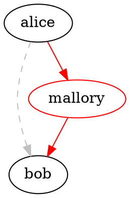

# Examples

---

```graphviz
strict digraph MitM {
  concentrate=true;

  alice;
  bob;
  mallory [color=red];

  alice -> bob [color=gray style=dashed];
  alice -> mallory -> bob [color=red];
}
```
