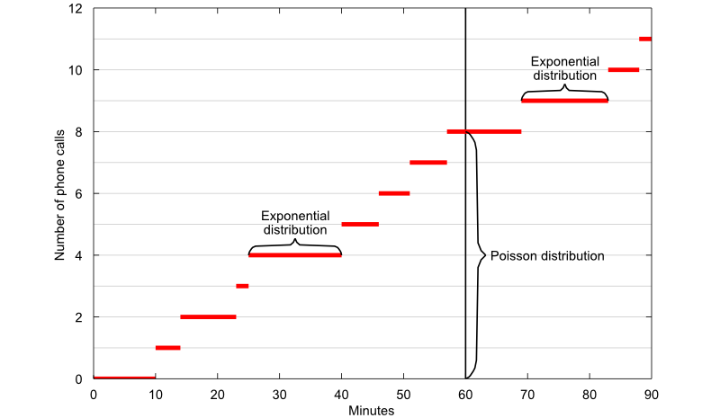
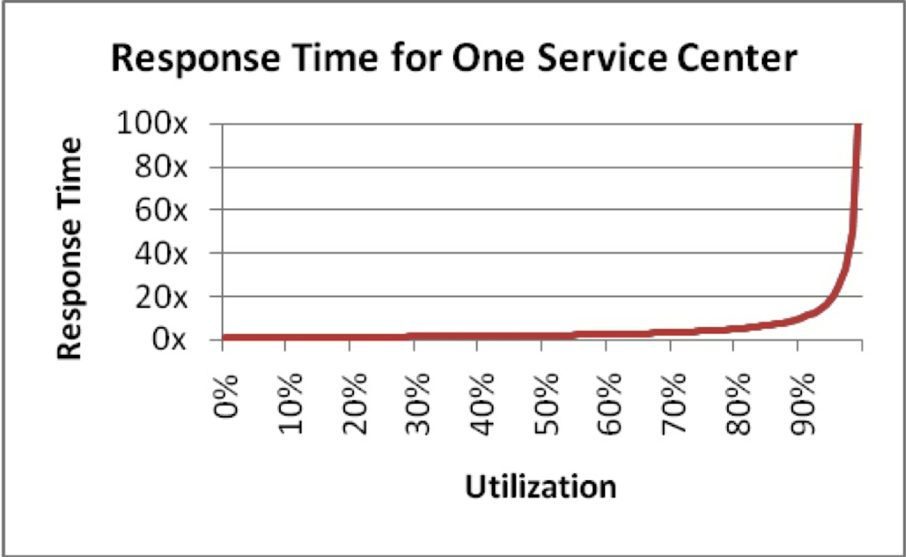
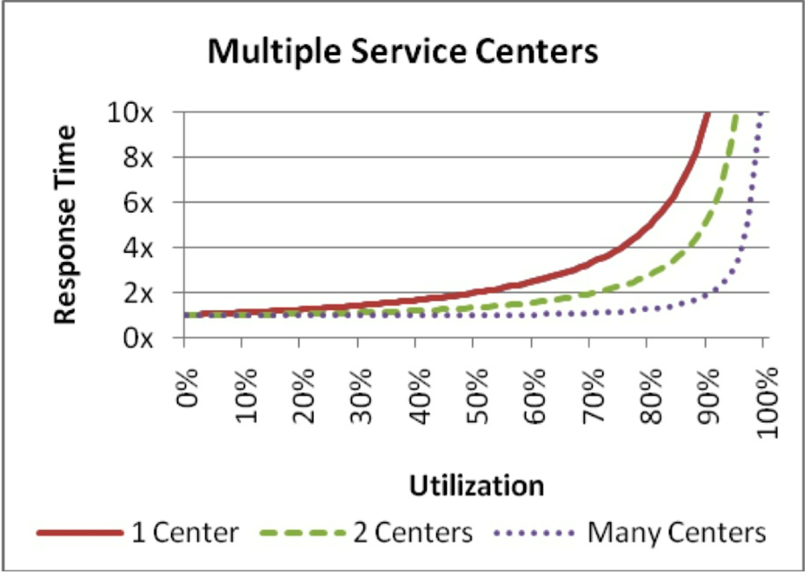
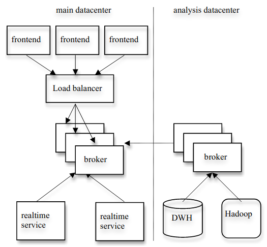
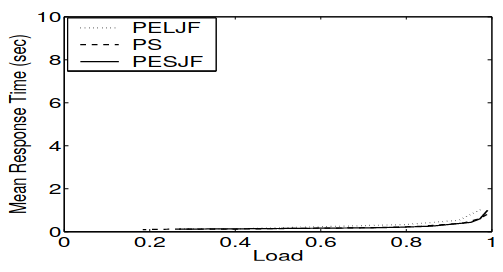
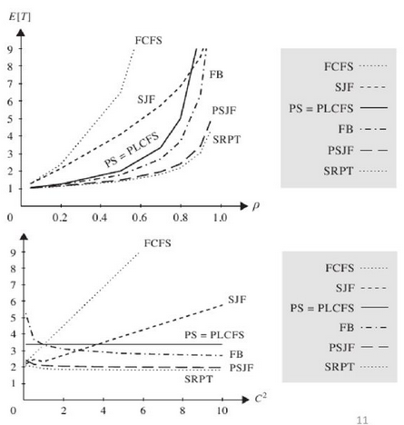

# Queueing

A brief survey on the theory of waiting in line with computers, software, and systems

---
# Meta

- About ~25 minutes
- Quick introduction into queueing theory and fundamentals
- Breadth-first survey of (hopefully) interesting topics
- Case studies and examples of queueing systems
- We'll skip most of the math, probability, derivations, proofs, etc.
- ...but provide references to resources where you can learn more!

---
# What's a queue?

```svgbob
      back                front
      ----+----+----+----+----+
          |    |    |    |    |
 enq      |    |    |    |    | deq
 --->     |    |    |    |    | --->
          |    |    |    |    |
          |    |    |    |    |
      ----+----+----+----+----+
                            ^peek
```

- _aka_ a line! e.g. grocery store, theme parks, etc.
- Collection of entities: messages, people, requests
- First in, first out (FIFO) or first come, first serve (FCFS)
- Basic operations: enqueue, dequeue, peek

---
# Where are queues?

**Everywhere!** e.g.

- Computers: CPU scheduling
- Disks and databases: write-ahead logs (WAL)
- Networking: packet queues
- Web servers: connection queues
- Customer support: ticketing systems
- Manufacturing: assembly lines
- Project management: work queues
- Utilities: water/plumbing
- Day-to-day: grocery lines, banks, traffic, DMV...

---
# A day at the bank

Given: a bank with **one** teller, customers taking **10 minutes** on average to serve and arriving at a rate of **5.8/hour**...

What is the expected wait time? How about with **two** tellers?

| One teller | Two tellers |
|------------|-------------|
| 5 minutes  | 3 minutes   |
| 50 minutes | 30 minutes  |
| 5 hours    | 3 hours     |

Ref: [What happens when you add a new teller?](https://www.johndcook.com/blog/2008/10/21/what-happens-when-you-add-a-new-teller/) (Cook 2008)

---
# Terminology

```plantuml
@startuml
scale 1.5
left to right direction

label λ
queue FCFS
node μ
label X

λ --> FCFS
FCFS --> μ
μ --> X
@enduml
```

- "M/M/1" or single-server queue
- service order, e.g. FCFS (default)
- λ: arrival rate
- μ: processing rate
- N: number of jobs in the queue
- X: throughput
- T: response time (time between arrival and departure, including waiting)
- 💡 An empty queue has the fastest response time

---
# Distributions

<div class="hcenter">



💡 Arrivals (λ) and service time (μ) are distributions!
"M" in M/M/1 is for Markovian (Poisson and Exponential)

</div>

---
# Bank tellers revisited

Given: customers taking **10 minutes** on average to serve and arriving at a rate of **5.8/hour**...

_Skipping a whole bunch of math aka "rest of the owl"..._

- $\lambda = 6.0, \mu = 5.8$
- 1 teller: $T_{Q,M/M/1} = \frac{\lambda}{\mu(\mu-\lambda)} = 4.83 hrs$
- 2 tellers: $T_{Q,M/M/2} = \frac{\lambda^3}{\mu(4\mu^2-\lambda^2)} = 0.05 hrs = 3.05 min$

---
# Response time vs. utilization

<div class="columns">

<div class="hcenter">



</div>

<div>

- $T = \frac{\mu}{1 - \rho}$, $\rho$: utilization (0.0-1.0)
- 💡 "It's very hard to use the last 15% of anything."
- 💡 "The slower the service center, the lower the maximum utilization you should plan for at peak load."
- Ref: [The Every Computer Performance Book][ecpb] (Wescott 2013)

</div>
</div>

---
# Response time with multiple service centers

<div class="columns">

<div class="hcenter">



</div>

<div>

- 1 to 2 tellers: switch from red to dashed green **and** move left
- Adding parallelism increases throughput, but results in a steeper cliff
- 💡 "The closer you are to the edge, the higher the price for being wrong."
- Ref: [The Every Computer Performance Book][ecpb] (Wescott 2013)

</div>
</div>

---
# Two queueing systems compared

Which is better for response time? A single fast server or slower, parallel servers?

<div class="columns">
<div class="hcenter vcenter">

```plantuml
@startuml
left to right direction

label "λ=1" as A
queue FCFS as QA
node "μ=4" as t
label "X[A]" as XA

A --> QA
QA --> t
t --> XA

@enduml
```

</div>

<div class="hcenter">

```plantuml
@startuml
left to right direction

label "λ=1" as B
queue FCFS as QB
node "μ=1" as p
node "μ=1" as q
node "μ=1" as r
node "μ=1" as s
label "X[B]" as XB

B --> QB
QB --> p
QB --> q
QB --> r
QB --> s
p --> XB
q --> XB
r --> XB
s --> XB

@enduml
```

</div>
</div>

- Under low load?
- Under high job variability?
- 💡 Queuing results from _variability_ in either service time or interarrival time!


---
# TCP: Transmission control protocol

<div class="columns">

<div class="hcenter">

```plantuml
@startuml
scale 1.5
left to right direction

node "μ[A]" as A
node "μ[B]" as B
queue send
queue recv

A --> send : socket
send -[#red;dashed]-> recv : X[A] ~> λ[B]
recv --> B : socket
recv -[#blue;dotted]-> send : rwnd

@enduml
```

```svgbob
+--------------++++++++++++
|              ||||||||||||
|              ||||||||||||
|<--- rwnd --->||||||||||||
|              ||||||||||||
|              ||||||||||||
+--------------++++++++++++

^              ^          ^
|              |          |
|              '-- buf -->|
+--------- recv ----------+
```

</div>

<div>

- _Caveat: gross simplification!_
- Two queues: send and receive buffers
- Packet loss: send > recv/arrivals
- 💡 **Backpressure**:
  - <span class="blue">**B** advertises the receive window (rwnd)</span>
  - <span class="red">**A** adjusts sending to not overwhelm **B**</span>
- Backpressure is sometimes good and sometimes bad (more on this later!)
- Here it prevents **overload** (next!)
- Ref: [TCP Flow Control](https://en.wikipedia.org/wiki/Transmission_Control_Protocol#Flow_control) (Wikipedia)

</div>
</div>

---
# Overload

```plantuml
@startuml
scale 2
left to right direction

label λ
queue FCFS
node μ
label X

λ --> FCFS
FCFS --> μ
μ --> X
@enduml
```

- Queues in practice have a size limit; going over it is "overload"
- When your system overloads, you have to:
  - Reject incoming work, e.g. load-shedding, drop packets
  - Interrupt ongoing work, e.g. task preemption, suspension
  - Change _something_
- FCFS: time in queue is pretty bad, for _everyone_
- 💡 Arrival rate (λ) < service rate (μ): _necessary_ for stability, but not _sufficient_!

---
# Bufferbloat


- Undesirable side effect of TCP congestion control
- "Bloated" buffers at a bunch of places in your system leads to lots of waiting, which result in latency and **lag**!
- Lots of super interesting algorithms on how to handle this, e.g. CoDel
- 💡 Queue size matters: size according to how much you (or your customers) are willing to wait

Ref: [Controlling Queue Delay][codel] (Nichols 2012)
Ref: [bufferbloat.net](bufferbloat.net)

---
# FCFS to LCFS

<div class="columns">

<div>

- What if we changed the default queue behavior?
- Trade-off _fairness_ for _response time_ (latency)
- Instead of all customers having a bad time, only some do (and they probably already retried or gave up)

</div>


</div>

Ref: [Meet Bandaid, the Dropbox service proxy][bandaid] (Dropbox 2018)

---
# Convoy effect


- Not to be confused with buffer bloat, but very similar
- Long job causes a backlog of much shorter jobs
- Convoy: things that can go faster being stuck behind things that are slower
- Very real problem in operating system architecture, e.g. older, cooperative scheduling systems would totally hang and crash if only one program did! (Pre-Windows 95)
- Generally fixed with multi-level (priority) queues and **task preemption**

---
# Revisiting the two systems with preemption

<div class="columns">
<div class="hcenter vcenter">

```plantuml
@startuml
left to right direction

label "λ=1" as A
queue FCFS as QA
node "μ=4" as t
label "X[A]" as XA

A --> QA
QA --> t
t --> XA

@enduml
```

</div>

<div class="hcenter">

```plantuml
@startuml
left to right direction

label "λ=1" as B
queue FCFS as QB
node "μ=1" as p
node "μ=1" as q
node "μ=1" as r
node "μ=1" as s
label "X[B]" as XB

B --> QB
QB --> p
QB --> q
QB --> r
QB --> s
p --> XB
q --> XB
r --> XB
s --> XB

@enduml
```

</div>
</div>

- With preemption, the M/M/1 can simulate and (mostly) match the M/M/4
- Suspending jobs, context-switching: how one CPU core can do many, _many_ things
- Common to use separate priority queues, e.g. multilevel feedback queue (MLFQ)

---
# Central vs. multiple queues

<div class="columns">
<div class="hcenter vcenter">

```plantuml
@startuml
left to right direction

label "λ" as A
queue FCFS as Q
node "μ" as p
node "μ" as q
node "μ" as r
node "μ" as s
label "X" as X

A --> Q
Q --> p
Q --> q
Q --> r
Q --> s
p --> X
q --> X
r --> X
s --> X

@enduml
```

Offline, batch systems
Larger queues
Optimized for throughput

</div>

<div class="hcenter">

```plantuml
@startuml
left to right direction

label "λ" as A
circle LB
queue FCFS as Q1
queue FCFS as Q2
queue FCFS as Q3
queue FCFS as Q4
node "μ" as p
node "μ" as q
node "μ" as r
node "μ" as s
label "X" as X

A --> LB
LB --> Q1
LB --> Q2
LB --> Q3
LB --> Q4
Q1 --> p
Q2 --> q
Q3 --> r
Q4 --> s
p --> X
q --> X
r --> X
s --> X

@enduml
```

Online, live systems
Critical to load-balancing
Optimized for latency

</div>
</div>

---
# Kafka

<div class="columns">



- Messaging queues used to decouple producers from consumers
- Queues managed by replicated brokers
- Distributed system with "levers" and tradeoffs:
  - Throughput
  - Latency
  - Durability
  - Availability

</div>

Ref: [Kafka: a Distributed Messaging System for Log Processing][kafka] (Kreps 2011)

---
# Performance

Queueing is central to systems performance:
- Latency (response time)
- Throughput
- Blocking $\rightarrow$ starvation

Ref/Example: [Don't Block the Event Loop (or the Worker Pool)](https://nodejs.org/en/docs/guides/dont-block-the-event-loop/) (node.js docs)

---
# Hidden bottlenecks

<div class="columns">

<div class="vcenter">

- Once you fix a bottleneck (**A**), a new, _hidden_ one (**B**) might appear!
- Testing component **B** in isolation may have surfaced this earlier
- Typically more common in _batch_ systems where you're concerned with throughput
- aka _whack-a-mole_

</div>

<div class="hcenter">


</div>
</div>

---
# Open versus closed

<div class="columns">

<div class="hcenter">


```graphviz
digraph {
  rankdir=LR;

  gen;
  queue [shape=box];
  server [shape=box3d];
  end [style=invis];

  gen:e -> queue:w;
  queue:e -> server:w;
  server:e -> end;
}
```

</div>

<div class="hcenter">



```graphviz
digraph {
  rankdir=LR;

  gen;
  queue [shape=box];
  server [shape=box3d];

  gen:e -> queue:w;
  queue:e -> server:w;
  server:n -> gen:n [style=dashed];
}
```

</div>

</div>

💡 If your load test is a closed-loop load generator, it might be lying to you!

Ref: [Open Versus Closed: A Cautionary Tale][ovc] (Schroeder 2006)

---
# Universal scaling law (USL)

$X(N)=\frac{\mu N}{1 - \alpha(N-1)+\beta N(N-1)}$

- Concurrency: $\mu$ is the slope in ideal parallelism
- Contention: $\alpha$ comes from queueing on shared resources
- Coherency: $\beta$ comes from cross-talk and consensus
- 🤔 Maybe this also applies to humans and organizations?


Ref: [Guerilla Capacity Planning][gcp] (Gunther 2007)

---
# Scheduling

<div class="columns">

<div>

| Algorithm | Description
|-----------|-------------
| (RAND)    | Randomly choose
| (RR)      | Round robin
| FCFS      | First come, first serve
| SJF       | Shortest job first
| PLCFS     | Preemptive LCFS
| FB        | Foreground-background
| PSJF      | Preemptive SJF
| SRPT      | Shortest remaining processing time

</div>

<div class="vcenter">



Ref: [Task Assignment with Unknown Duration][tags] (Harchol-Balter 2002)

</div>

</div>

---
# (Don't forget) security!

<div class="columns">
<div class="hcenter vcenter">

```plantuml
@startuml
left to right direction

actor Alice
actor Bob
actor Mallory
actor Eve
queue queue

Alice --> queue
queue --> Bob
Mallory -[#red,dashed]> queue : tamper
queue -[#red,dashed]> Eve : eavesdrop
@enduml
```

</div>

- Access control: who can send/receive?
- Authenticity: who did the message come from?
- Integrity: did the message change?
- Access control $\neq$ authenticity, integrity
- 💡 Queues are just channels. If you want security and privacy, you must secure it end-to-end.
- Ref: [End-to-end Arguments in System Design][e2e] (Saltzer 1984)

</div>

---
# Key takeaways

- Queueing is critical to performance, both response time and throughput
- Full (and overflowing) queues are bad for response time
- Lots of unintuitive trade-offs in architecture and algorithm choice

There's _so_ much more. Where to learn more about queueing?

---


---
# Reading

- [Controlling Queue Delay][codel] (Nichols 2012)
- [Don't Block the Event Loop (or the Worker Pool)](https://nodejs.org/en/docs/guides/dont-block-the-event-loop/) (node.js)
- [End-to-end Arguments in System Design][e2e] (Saltzer 1984)
- [The Every Computer Performance Book][ecpb] (Wescott 2013)
- [Guerilla Capacity Planning][gcp] (Gunther 2007)
- [Kafka: a Distributed Messaging System for Log Processing][kafka] (Kreps 2011)
- [Meet Bandaid, the Dropbox service proxy][bandaid] (Dropbox 2018)
- [Open Versus Closed: A Cautionary Tale][ovc] (Schroeder 2006)
- [Performance Modeling and Design of Computer Systems][pmdcs] (Harchol-Balter 2013)
- [Task Assignment with Unknown Duration][tags] (Harchol-Balter 2002)

[bandaid]: https://dropbox.tech/infrastructure/meet-bandaid-the-dropbox-service-proxy
[codel]: https://dl.acm.org/doi/pdf/10.1145/2208917.2209336?download=true
[ecpb]: https://www.amazon.com/Every-Computer-Performance-Book-Wescott/dp/1482657759
[e2e]: https://web.mit.edu/Saltzer/www/publications/endtoend/endtoend.pdf
[gcp]: http://www.perfdynamics.com/books.html
[kafka]: https://www.microsoft.com/en-us/research/wp-content/uploads/2017/09/Kafka.pdf
[ovc]: https://kilthub.cmu.edu/articles/journal_contribution/Open_Versus_Closed_A_Cautionary_Tale/6608078/1
[pmdcs]: https://www.amazon.com/Performance-Modeling-Design-Computer-Systems/dp/1107027500/
[tags]: https://dl.acm.org/doi/10.1145/506147.506154

---
# Thanks! 👋
